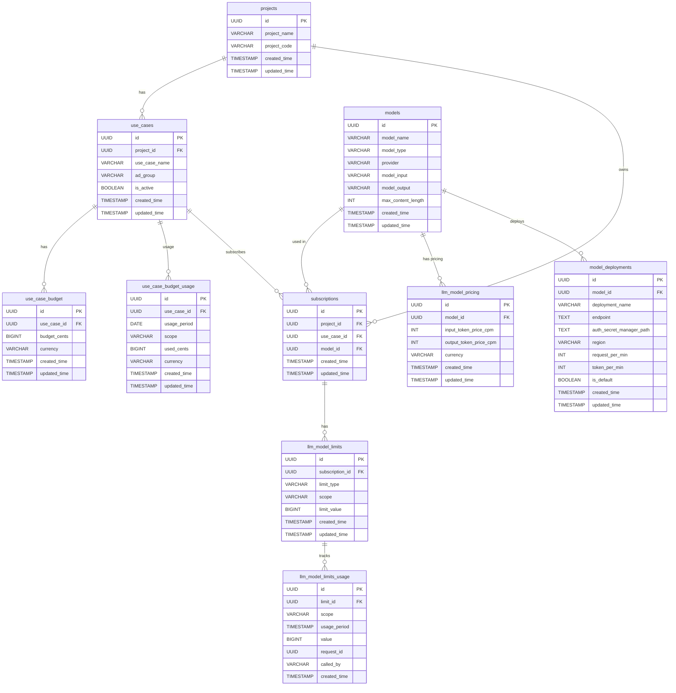

# 1. Database Schema Design

## 1.1 `projects` Table (Sync from Model Garden)

```sql
TABLE projects (
  id UUID PRIMARY KEY,
  project_name VARCHAR NOT NULL,
  project_code VARCHAR NOT NULL,
  created_time TIMESTAMP,
  updated_time TIMESTAMP
);
```

## 1.2 `use_cases` Table (Sync from Model Garden)

```sql
TABLE use_cases (
  id UUID PRIMARY KEY,
  project_id UUID REFERENCES projects(id),
  use_case_name VARCHAR NOT NULL,
  ad_group VARCHAR NOT NULL,
  is_active BOOLEAN DEFAULT TRUE,
  created_time TIMESTAMP,
  updated_time TIMESTAMP
);
```

## 1.3 `use_case_budget` Table (Sync from Model Garden)

```sql
TABLE use_case_budget (
  id UUID PRIMARY KEY,
  use_case_id UUID REFERENCES use_cases(id),
  budget_cents BIGINT NOT NULL,
  currency VARCHAR DEFAULT 'USD',
  created_time TIMESTAMP,
  updated_time TIMESTAMP
);
```

## 1.4 `use_case_budget_usage` Table (Own by AI Gateway)

```sql
TABLE use_case_budget_usage (
  id UUID PRIMARY KEY,
  use_case_id UUID REFERENCES use_cases(id),
  usage_period DATE NOT NULL,
  scope VARCHAR NOT NULL,
  used_cents BIGINT DEFAULT 0,
  currency VARCHAR DEFAULT 'USD',
  created_time TIMESTAMP,
  updated_time TIMESTAMP,
  UNIQUE(use_case_id, usage_period, scope)
);
```

## 1.5 `models` Table (Sync from Model Garden)

```sql
TABLE models (
  id UUID PRIMARY KEY,
  model_name VARCHAR NOT NULL,
  model_type VARCHAR NOT NULL,
  provider VARCHAR,
  model_input VARCHAR,
  model_output VARCHAR,
  max_content_length INT,
  created_time TIMESTAMP,
  updated_time TIMESTAMP
);
```

## 1.6 `model_deployments` Table (Sync from Model Garden)

```sql
TABLE model_deployments (
  id UUID PRIMARY KEY,
  model_id UUID REFERENCES models(id),
  deployment_name VARCHAR NOT NULL, 
  endpoint TEXT NOT NULL,
  auth_secret_manager_path TEXT,
  region VARCHAR, 
  request_per_min INT,
  token_per_min INT,
  is_default BOOLEAN DEFAULT FALSE, 
  created_time TIMESTAMP,
  updated_time TIMESTAMP,
  UNIQUE(model_id, deployment_name)
);
```

## 1.7 `llm_model_pricing` Table (Sync from Model Garden)

```sql
TABLE llm_model_pricing (
  id UUID PRIMARY KEY,
  model_id UUID REFERENCES models(id),
  input_token_price_cpm INT NOT NULL,
  output_token_price_cpm INT NOT NULL,
  currency VARCHAR DEFAULT 'USD',
  created_time TIMESTAMP,
  updated_time TIMESTAMP
);
```

## 1.8 `Subscriptions` Table (Sync from Model Garden)

```sql
TABLE subscriptions (
  id UUID PRIMARY KEY,
  project_id UUID REFERENCES projects(id),
  use_case_id UUID REFERENCES use_cases(id),
  model_id UUID REFERENCES models(id),
  created_time TIMESTAMP,
  updated_time TIMESTAMP
);
```

## 1.9 `llm_model_limits` Table (Sync from Model Garden)

```sql
TABLE llm_model_limits (
  id UUID PRIMARY KEY,
  subscription_id UUID REFERENCES subscriptions(id),
  limit_type VARCHAR NOT NULL,
  scope VARCHAR NOT NULL,
  limit_value BIGINT NOT NULL,
  created_time TIMESTAMP,
  updated_time TIMESTAMP
);
```

## 1.10 `llm_model_limits_usage` Table (Own by AI Gateway)

```sql
TABLE llm_model_limits_usage (
  id UUID PRIMARY KEY,
  limit_id UUID REFERENCES llm_model_limits(id),
  scope VARCHAR NOT NULL,
  usage_period TIMESTAMP NOT NULL,
  value BIGINT DEFAULT 0,
  request_id UUID,
  called_by VARCHAR,
  created_time TIMESTAMP DEFAULT now()
);
```

# 2. ER Diagram (Mermaid)



# 3. Redis Cache Design

## 3.1 Authorization Cache

### use_case → AD groups

```
KEY: auth:use_case:{use_case_id}:ad_groups
TYPE: Set
VAL: [ad_risk, ad_compliance]
```

### use_case → allowed_models

```
KEY: auth:use_case:{use_case_id}:allowed_models
TYPE: Set
VAL: [gpt-4, gpt-4-turbo]
```

## 3.2 Rate Limit

```
KEY: ratelimit:{use_case_model_id}:{scope}:{period}
VAL: request count
```

## 3.3 Token Limit

### Input Token

```
KEY: tokenlimit:{use_case_model_id}:input:{scope}
VAL: max limit

KEY: tokenusage:{use_case_model_id}:input:{scope}:{period}
VAL: used token count
```

### Output Token

```
KEY: tokenlimit:{use_case_model_id}:output:{scope}
VAL: max limit

KEY: tokenusage:{use_case_model_id}:output:{scope}:{period}
VAL: used token count
```

## 3.4 LLM Route Cache

```
KEY: route:{use_case_id}:{model_alias}
VAL: {
  "llm_model_id": "uuid",
  "model_name": "gpt-4-turbo",
  "endpoint": "...",
  "auth_type": "api_key",
  "auth_secret_manager_path": "...",
  "vendor": "openai"
}
```

## 3.5 Cost Limit

### Cost Limit (total)

```
KEY: costlimit:{use_case_id}
VAL: total limit (in cents)
TTL: persistent or synced periodically
```

### Cost Usage (per period)

```
KEY: costusage:{use_case_id}:{scope}:{period}
VAL: amount used (in cents)
TTL: depends on scope (e.g. daily = 24h)
```

### Cost Balance (optional, for faster access)

```
KEY: costbalance:{use_case_id}
VAL: remaining budget = limit - usage (in cents)
TTL: updated after every call or on schedule
```
