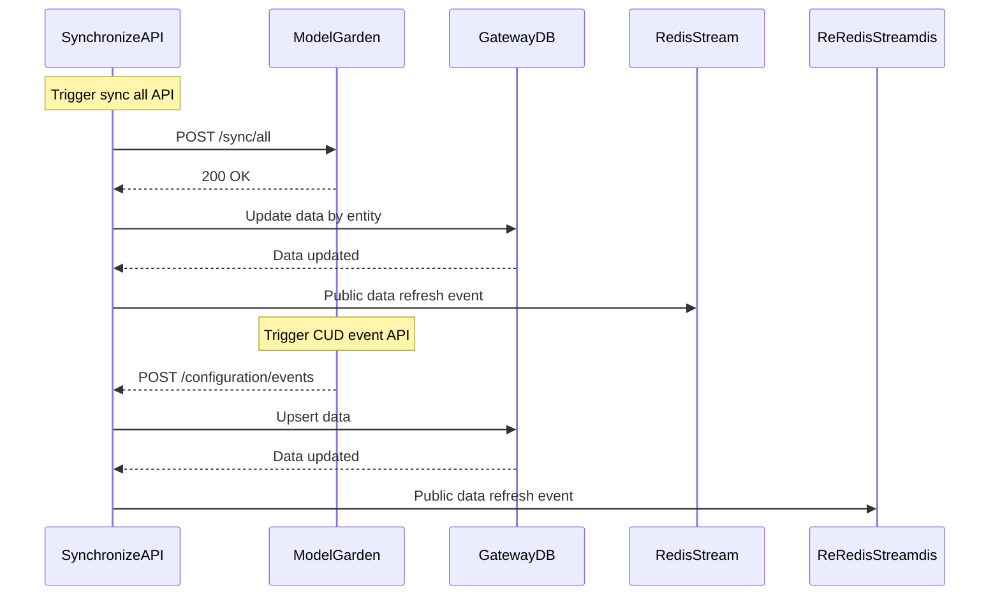

# Synchronize API Design Document

## 1. API Overview

The Synchronize API enables the AI Gateway to sync LLM-related configuration data from the Model Garden system. It supports both:

* **Full Synchronization**: Periodically pulls all project-related configuration from Model Garden.
* **Event-based Synchronization**: Model Garden pushes fine-grained CUD (Create/Update/Delete) events to Gateway.

The data covers:

* Projects
* Use Cases
* Budgets
* Models
* Model Deployments
* Model Pricing
* Subscriptions
* LLM Model Limits

---

## 2. API Definitions

### 2.1 All Synchronization Endpoint

**Endpoint:** `POST /model-garden/sync/all`

#### OpenAPI YAML: sync-api.yml

#### Request Example

```json
{
  "updated_since": "2025-07-01T00:00:00Z"   // optional
}
```

#### Response Example

```json
{
  "projects": [
    {
      "id": "proj-001",
      "project_name": "Credit AI",
      "project_code": "CREDIT_AI",
      "created_time": "2025-01-01T00:00:00Z",
      "updated_time": "2025-07-10T10:00:00Z"
    }
  ],
  "use_cases": [
    {
      "id": "uc-001",
      "project_id": "proj-001",
      "use_case_name": "fraud_detection",
      "ad_group": "ad_fraud",
      "is_active": true,
      "created_time": "2025-01-05T00:00:00Z",
      "updated_time": "2025-07-10T12:00:00Z"
    }
  ],
  "budgets": [
    {
      "id": "budget-001",
      "use_case_id": "uc-001",
      "budget_cents": 500000,
      "currency": "USD",
      "created_time": "2025-01-10T00:00:00Z",
      "updated_time": "2025-07-10T12:30:00Z"
    }
  ],
  "models": [
    {
      "id": "model-abc",
      "model_name": "gpt-4",
      "model_type": "chat",
      "provider": "openai",
      "model_input": "text",
      "model_output": "text",
      "max_content_length": 1000000,
      "created_time": "2025-01-01T00:00:00Z",
      "updated_time": "2025-07-11T08:00:00Z"
    }
  ],
  "model_deployments": [
    {
      "id": "deploy-001",
      "model_id": "model-abc",
      "deployment_name": "gpt4-prod",
      "endpoint": "https://llm.gateway.ai/v1/deploy/gpt4-prod",
      "auth_secret_manager_path": "projects/demo/secrets/deploy-key",
      "region": "us-central1",
      "request_per_min": 600,
      "token_per_min": 60000,
      "is_default": true,
      "created_time": "2025-06-01T00:00:00Z",
      "updated_time": "2025-07-11T09:00:00Z"
    }
  ],
  "pricing": [
    {
      "id": "price-001",
      "model_id": "model-abc",
      "input_token_price_cpm": 15,
      "output_token_price_cpm": 30,
      "currency": "USD",
      "created_time": "2025-01-15T00:00:00Z",
      "updated_time": "2025-07-11T09:10:00Z"
    }
  ],
  "use_case_llm_models": [
    {
      "id": "sub-001",
      "project_id": "proj-001",
      "use_case_id": "uc-001",
      "model_id": "model-abc",
      "alias": "default",
      "created_time": "2025-02-01T00:00:00Z",
      "updated_time": "2025-07-12T00:00:00Z"
    }
  ],
  "limits": [
    {
      "id": "limit-001",
      "subscription_id": "sub-001",
      "limit_type": "input_token_limit",
      "scope": "daily",
      "limit_value": 1000000,
      "created_time": "2025-03-01T00:00:00Z",
      "updated_time": "2025-07-12T08:00:00Z"
    }
  ]
}
```

### 2.2 Event Synchronization Endpoint

**Endpoint:** `POST /api/v1/model-garden/events`

#### OpenAPI YAML: sync-api-event.yml

#### Request Example

##### Project 

```json
{
  "event_type": "CREATED",
  "entity_type": "project",
  "entity_id": "proj-001",
  "timestamp": "2025-07-15T14:20:00Z",
  "version": "1.0",
  "payload": {
    "id": "proj-001",
    "project_name": "Credit AI",
    "project_code": "CREDIT_AI",
    "created_time": "2025-07-15T14:00:00Z",
    "updated_time": "2025-07-15T14:00:00Z"
  }
}
```

##### Use Case

```json
{
  "event_type": "CREATED",
  "entity_type": "use_case",
  "entity_id": "uc-001",
  "timestamp": "2025-07-15T14:20:00Z",
  "version": "1.0",
  "payload": {
    "id": "uc-001",
    "project_id": "proj-001",
    "use_case_name": "fraud_detection",
    "ad_group": "ad_fraud",
    "is_active": true,
    "created_time": "2025-07-15T14:00:00Z",
    "updated_time": "2025-07-15T14:00:00Z"
  }
}
```

##### Use Case Budget

```json
{
  "event_type": "CREATED",
  "entity_type": "use_case_budget",
  "entity_id": "budget-001",
  "timestamp": "2025-07-15T14:20:00Z",
  "version": "1.0",
  "payload": {
    "id": "budget-001",
    "use_case_id": "uc-001",
    "budget_cents": 1000000,
    "currency": "USD",
    "created_time": "2025-07-15T14:00:00Z",
    "updated_time": "2025-07-15T14:00:00Z"
  }
}
```

##### Model

```json
{
  "event_type": "CREATED",
  "entity_type": "model",
  "entity_id": "model-abc",
  "timestamp": "2025-07-15T14:20:00Z",
  "version": "1.0",
  "payload": {
    "id": "model-abc",
    "model_name": "gpt-4",
    "model_type": "chat",
    "provider": "openai",
    "model_input": "text",
    "model_output": "text",
    "max_content_length": 1000000,
    "created_time": "2025-07-15T14:00:00Z",
    "updated_time": "2025-07-15T14:00:00Z"
  }
}
```

##### model_deployment

```json
{
  "event_type": "CREATED",
  "entity_type": "model_deployment",
  "entity_id": "deploy-001",
  "timestamp": "2025-07-15T14:20:00Z",
  "version": "1.0",
  "payload": {
    "id": "deploy-001",
    "model_id": "model-abc",
    "deployment_name": "gpt4-prod",
    "endpoint": "https://llm.gateway.ai/v1/deploy/gpt4-prod",
    "auth_secret_manager_path": "projects/llm/secrets/prod-key",
    "region": "us-central1",
    "request_per_min": 600,
    "token_per_min": 60000,
    "is_default": true,
    "created_time": "2025-07-15T14:00:00Z",
    "updated_time": "2025-07-15T14:00:00Z"
  }
}
```

##### Model Pricing

```json
{
  "event_type": "CREATED",
  "entity_type": "llm_model_pricing",
  "entity_id": "price-001",
  "timestamp": "2025-07-15T14:20:00Z",
  "version": "1.0",
  "payload": {
    "id": "price-001",
    "model_id": "model-abc",
    "input_token_price_cpm": 15,
    "output_token_price_cpm": 30,
    "currency": "USD",
    "created_time": "2025-07-15T14:00:00Z",
    "updated_time": "2025-07-15T14:00:00Z"
  }
}
```

##### Subscription

```json
{
  "event_type": "CREATED",
  "entity_type": "subscription",
  "entity_id": "sub-001",
  "timestamp": "2025-07-15T14:20:00Z",
  "version": "1.0",
  "payload": {
    "id": "sub-001",
    "project_id": "proj-001",
    "use_case_id": "uc-001",
    "model_id": "model-abc",
    "alias": "default",
    "created_time": "2025-07-15T14:00:00Z",
    "updated_time": "2025-07-15T14:00:00Z"
  }
}
```

##### Model Limit

```json
{
  "event_type": "CREATED",
  "entity_type": "llm_model_limit",
  "entity_id": "limit-001",
  "timestamp": "2025-07-15T14:20:00Z",
  "version": "1.0",
  "payload": {
    "id": "limit-001",
    "subscription_id": "sub-001",
    "limit_type": "input_token_limit",
    "scope": "daily",
    "limit_value": 500000,
    "created_time": "2025-07-15T14:00:00Z",
    "updated_time": "2025-07-15T14:00:00Z"
  }
}
```

#### Response Example

```json
{ "status": "ok" }
```

---

## 3. API Processing Flow

### 3.1 Sequence Diagram (Full Sync)



---

## 4. Development Language Consideration

* Recommended: **Python** (FastAPI or Flask)
* Alternatives: **Go** (Gin or Echo), **Java** (Spring Boot)

**Why Python?**

* Fast iteration, rich JSON support
* Good ORM/DB tooling (SQLAlchemy, Alembic)
* Easier for scripting orchestration

---

## 5. Dependencies

* Internal HTTP SDK to call Model Garden
* DB ORM (e.g. SQLAlchemy or Prisma)
* Redis client (e.g. redis-py)
* JSON Schema validator for payload
* Optional: Kafka or EventBus for queueing (if async processing)

---

## 6. Other Considerations

* ⚠️ All writes should be **idempotent**
* ⏱ Supports `updated_since` for incremental sync
* ✅ API-level tracing: request\_id, version, timestamp
* 🔐 Add HMAC or JWT-based authentication for event sync
* 📦 Consider writing to S3/Blob first in large datasets
* 🧪 Include test harness that simulates all entity sync types
